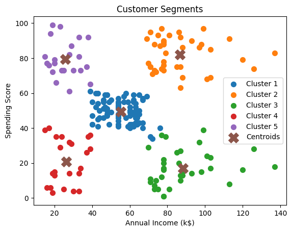

# Thiranex Customer Segmentation Project

## Project Overview

This project focuses on customer segmentation using machine learning techniques. Customers are grouped into meaningful segments based on their annual income and spending score.

The project uses the K-Means clustering algorithm to identify customer groups with similar purchasing behaviour.

## Objectives

- Analyze customer data and purchasing behaviour.
- Identify meaningful customer segments.
- Apply K-Means clustering for customer segmentation.
- Visualize the identified customer groups.
- Generate useful business insights from the customer segments.

## Technologies Used

- Python
- Pandas
- NumPy
- Matplotlib
- Scikit-learn
- K-Means Clustering

## Dataset

The project uses the Mall Customers dataset.

The dataset contains customer information such as:

- Customer ID
- Gender
- Age
- Annual Income
- Spending Score

## Methodology

### 1. Data Loading
The customer dataset is loaded using Pandas.

### 2. Feature Selection
Annual Income and Spending Score are selected as the main features for clustering.

### 3. Elbow Method
The Elbow Method is used to determine a suitable number of clusters by analyzing the Within-Cluster Sum of Squares (WCSS).

### 4. K-Means Clustering
K-Means clustering is applied to divide customers into five meaningful groups.

### 5. Visualization
The resulting customer segments and cluster centroids are visualized using Matplotlib.

## Customer Segmentation

The clustering process helps identify groups such as:

- Customers with high income and high spending
- Customers with high income and low spending
- Customers with low income and high spending
- Customers with low income and low spending
- Customers with moderate income and spending

## Business Insights

Customer segmentation can help businesses:

- Design targeted marketing campaigns.
- Identify high-value customers.
- Develop personalized offers.
- Improve customer retention strategies.
- Understand different purchasing behaviours.

## Project Structure

```text
thiranex-customer-segmentation/
│
├── customer_segmentation.py
├── requirements.txt
└── README.md
## Results and Visualizations

### Elbow Method

The Elbow Method was used to determine the appropriate number of clusters for the K-Means algorithm.


### Customer Segmentation

The K-Means algorithm successfully divided the customers into 5 clusters based on Annual Income and Spending Score.


